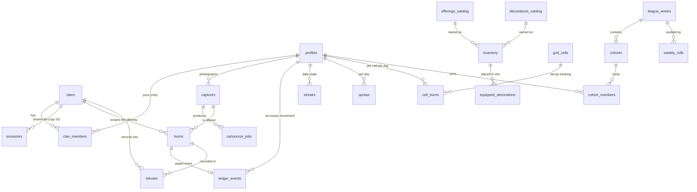

# 07 · System architecture & data model — SCRUM-10

**Status:** ✅ v2.8 — **stack LOCKED (ADR-001)** · service boundaries + API sketch + data model (session 17) · **v2.7: clan model applied (SCRUM-22)** · **v2.8: clan invitation/QR path → §4.6 (SCRUM-50)**
**Date:** 2026-09-26
**Jira:** SCRUM-10 · In Progress
**Related:** [[06-tech-stack-options]] (the stack decision this builds on) · [[05-concept-to-mvp-gap-analysis]] §8 (the brief) · [[04-ar-app-patterns]] · [[next-ai-context]]

> **Stack — LOCKED (ADR-001, 2026-09-26):** **Option A — Expo / React Native (TypeScript) + Supabase + hosted AI APIs**, Android-first, iOS deferred, *non-AR AR* MVP (camera + overlay). This document is the **authoritative service map and schema** for that stack; the context, rejected alternatives and consequences live in [[ADR-001-option-a-expo-rn-supabase-hosted-ai]].

---

## 1 · What this document is (and isn't)

**Is:** the system diagram, the service boundaries, the API sketch (capture → cartoonize → burn → award → league), and the data model — the schema every later spec hangs off.
**Isn't:** the economy numbers (SCRUM-18), the retention windows (SCRUM-19), the NFR/device targets (SCRUM-20), the integrity one-pager (SCRUM-21), or the ancestor-addressing decision (SCRUM-22 → [[15-clan-model-and-book-of-tributes]]). Those are called out inline as *open* where they touch the schema.

---

## 2 · System diagram

```
┌──────────────────────── THE APP — Expo / React Native (TS), Android-first ────────────────────────┐
│  expo-camera (live view + capture)   Throw screen (60 fps, fixed-position fire overlay)           │
│  offline capture queue               local cache (SQLite) · i18n EN/中 · design-system UI         │
└──────────┬───────────────────────────────────────────────────────┬───────────────────────────────┘
           │  HTTPS · Supabase client · anon key + RLS            │  HTTPS · API key lives ONLY here
           ▼                                                       ▼
┌──────────────────────────────────────┐         ┌──────────────────────────────────────────────────┐
│  SUPABASE (backend of record)        │         │  HOSTED AI APIs (day one — no GPU capex)         │
│  · Auth — anonymous first, → account │         │  1. closed-set object ID (Track B short-circuit)│
│  · Postgres — tables in §5 + RLS     │────────▶│  2. extract ≤3 objects + precise source colours │
│  · Storage — private buckets:        │  Edge   │  3. style-D generate (nano-2 t2i — Path C,      │
│      captures/ · styled/ · tributes/ │  Fn key │     ADR-002) → clean sprite by construction    │
│  · Edge Functions:                   │         └──────────────────────────────────────────────────┘
│      cartoonize-orchestrator         │
│      award-service  (the only        │         ┌──────────────────────────────────────────────────┐
│        writer of ledger money)       │         │  THIRD-PARTY, opt-in, never in the ritual flow   │
│      weekly-roll (cron)              │         │  · family-safe ads SDK (monetization)            │
│  · Realtime — league channel         │         │  · privacy-safe analytics (no names, no location)│
└──────────────────────────────────────┘         └──────────────────────────────────────────────────┘
```

**Boundary rule:** the client may *assert* (photo, aim measurement, cell hash); the server *decides* (quota, streak, new-ground flag, catalogue values, final award). Only `award-service` writes money rows — no client path touches `ledger_events` except through it.

---

## 3 · Service boundaries & responsibilities

| # | Service | Owns | Explicitly does NOT own |
|---|---------|------|--------------------------|
| 1 | **App client** (Expo/RN) | camera, capture compression, throw input + band measurement, offline queue, UI state, i18n | award maths, quota state, league ranking |
| 2 | **Supabase Auth** | anonymous device identity → optional account (nobody in this demo gets a signup wall before the first burn) | profile content, ancestor data |
| 3 | **Postgres (+ RLS)** | every table in §5; row-level isolation per `user_id` | file bytes (→ Storage) |
| 4 | **Storage** | raw captures, styled results, tribute images — **private buckets**, signed URLs | catalogue (code-owned, ships in the app) |
| 5 | **`cartoonize-orchestrator`** (Edge Fn) | quota gate → provider call → moderation → cost/latency recording → status transitions | burning, points |
| 6 | **`award-service`** (Edge Fn) | validating a burn, computing the award, appending `ledger_events`, idempotency | UI, photos |
| 7 | **`weekly-roll`** (Edge Fn, cron) | closing a league week, re-ranking, promotion/demotion, decay ticks | anything interactive |
| 8 | **Hosted AI APIs** | closed-set ID → object/attribute extraction → style-D generation (**Path C**, [[ADRs/ADR-002-path-c-describe-then-generate\|ADR-002]]) | our data (stateless calls; no PII beyond the image) |
| 9 | **Realtime channel** | league board pushes (`league:{cohort_id}`) | authoritative ranking (that's a DB query) |
| 10 | **Ads SDK** *(post-spike)* | ad rendering outside the ritual flow | anything in the burn sequence — hard rule |
| 11 | **Analytics** *(opt-in)* | funnel/cost events, anonymous ids | ancestor names, photos, raw coordinates |

---

## 4 · API sketch — the one flow that matters

`capture → cartoonize → burn → award → league`, with the server-authoritative step marked.

### 4.1 Capture (client → Storage)
1. User photographs an object → client compresses (bounded long edge, JPEG q) → uploads to `captures/{user_id}/{capture_id}.jpg`.
2. Row inserted into `captures` with `status = 'pending'`.

### 4.2 Cartoonize (Edge Fn `cartoonize-orchestrator`)

> **Catalogue short-circuit (PM decision, S17):** if identification matches a **store catalogue item** (e.g. joss-paper stack, incense — spike inputs S10/S11), **skip stylization entirely** and return the standard painted asset — one identification call, no `cartoonize_jobs` row, near-zero cost. **Identify model = `moondream2` (ADR-002)**; match threshold + user-override → SCRUM-18. Tested by spike **Track B** (see [[08-style-d-spike-plan]] §4).

3. `rpc.request_cartoonize(capture_id)` — checks **quota** for today (`quotas.burns_used` / AI-spend budget, SCRUM-18), inserts `cartoonize_jobs (provider, style='D')`.
4. Orchestrator runs the **Path C describe-then-generate pipeline (ADR-002, PM-locked 2026-09-26; details → [[../spike/results/RESULTS]] §5b):** **① identify** — `fal-ai/moondream2/visual-query` extracts **≤3 objects + precise source colours** (no example colours in the prompt; closed-set Track B runs first as the catalogue short-circuit above) → **validate** (schema · dedupe · colour sanity · majority-vote counts for count-critical objects) → **② generate** — `fal-ai/nano-banana-2` **text-to-image** with the **v3 template** (source-colour lock · top-down lighting shader · transparent glass · no ground shadow · blank rice-paper background · coarse 40–60 facets + ink outline + matte) → **transparent sprite by construction** (no bg-removal, no lighting filter, no re-cut — the stages the edit path needed). Failed validation or PM-fail ⇒ **targeted re-probe → regenerate** (≈$0.09/retry; `retries` recorded on the job row). Records `cost_micros`, `latency_ms`, `error` — spike actuals: **≈US$0.09/picture** (≤0.13 with retries), identify 1.1s + t2i p50 11.5s ≈ **12.6s** (→ the wait is UI; SCRUM-18). *Fallback if instance-fidelity fails at scale: the edit-based recipe (RESULTS round 6) — documented in ADR-002.*
5. Result written to `styled/{user_id}/{capture_id}.png`; `captures.status → 'styled'` (or `'rejected'` on moderation).
6. Client polls / subscribes; **the wait is UI** ("the offering is being prepared" — gap-analysis risk #3). Offline captures queue and replay on reconnect.

### 4.3 Burn + award (Edge Fn `award-service` — server-authoritative)
7. `rpc.submit_burn({ capture_id | item_code, ancestor_id?, accuracy, cell_hash, client_time }, idempotency_key)` — **the client does not send `band`**: the server derives it from `accuracy` (ADR-005)
8. Server **recomputes** everything it can: quota still open? streak day (from `streaks`)? new-ground (from `grid_cells`)? band = derive(`accuracy`) → award via the formula in §6, clamped to **0…1,650**. The client's `accuracy` is *accepted with caps* (a physical throw can't be verified — [[11-integrity-posture]]); rate limit 6/min.
9. Transaction: append `burns` + `ledger_events` (type `award`, unique `idempotency_key` → **replay-safe offline queue**); bump `streaks`, `quotas`, `cell_burns` (decay tick).
10. Returns the **receipt** the Reward screen renders — including the *New ground bonus* line (location value stays HIDDEN as UI, S11).

### 4.4 League
11. `rpc.get_league_board()` → derived from `SUM(ledger weekly)` per cohort member (never a stored mutable score); client subscribes to `league:{cohort_id}` Realtime channel for live re-rank after each burn.
12. Cron `weekly-roll`: close week → rank → **top 3 promote / bottom 3 demote** (Duolingo-style cohorts, SCRUM-11) → write `weekly_rolls` audit row → open next `league_weeks`.

### 4.5 Everything else (sketch only)
- `rpc.purchase_item(item_code, idempotency_key)` — spend store points; inserts `inventory` + ledger event `purchase`.
- `rpc.equip_decoration(slot, item_code)` — enforces the **one-set-per-category rule** (S14k) and the 6-slot grid.
- `rpc.save_ancestor(...)` — CHECK ≤ 4 non-archived tablets per user.
- `rpc.delete_my_data()` — the delete-all path (privacy, SCRUM-19 — to be specified).

### 4.6 Clan invitations — one secret, three presentations (SCRUM-50 · boards = SCRUM-48)

**Behaviour source:** [[15-clan-model-and-book-of-tributes]] §5.1. **Design:** SCRUM-48 boards (`EN · 0e Clan` / `ZH · 0e 宗族`). **Build:** **SCRUM-50**.

`clans.code` is the secret; **link · QR · copy-paste are three ways to carry it**. The whole path is client-cheap and offline-tolerant by construction.

| Piece | Decision | Why |
|---|---|---|
| **The code** | `clans.code` — **8 chars**, unambiguous alphabet (no `0/O`, `1/I/L`), **server-generated**, **one active code per clan**, **re-rollable by a head** | human-typable; it is a **capability** (whoever holds it can join) → must be re-rollable and throttled |
| **QR payload** | the **invite deep link**, not the bare code: `https://josspaperar.app/join/{code}` (App/Universal Link) + `josspaperar://join?code={code}` fallback | one payload serves **QR · link · share sheet**, and routes to the store when the app is not installed |
| **Generation** | **client-side** from the cached code — pure-JS encoder (`react-native-qrcode-svg`); **no server call, no image upload** | zero cost/latency, **works offline**, and the code only leaves the device via the share action the user chose |
| **Scanning** | `expo-camera` `CameraView` + `barcodeScannerSettings: { barcodeTypes: ['qr'] }` | camera is already the app's camera module (§2) and the permission is already requested at onboarding (`0b2`) — **no new native module** |
| **Resolve → preview → join** | parse → `rpc.preview_clan(code)` → preview card → `rpc.join_clan(code)` | **no approval queue** (spec §4.3) — a valid code joins instantly; bad / revoked / already-a-member fails loudly (`0e10` · `0e12`) |
| **Deep-link routing** | `expo-linking` + `expo-router`, **cold + warm start**; an invite opened **before first-run completes is held**, then applied | invites arrive from outside the app; a brand-new user must not hit a dead end |
| **Anti-abuse** | join attempts throttled via `rate_counters` (§5.3 · [[11-integrity-posture]] §5); the limits live in **SCRUM-46** | a guessable capability needs a throttle |
| **Privacy** | the QR/link carries **only the code** — never ancestor names, member counts, or `clan_id`; the code is **excluded from analytics/logs** | [[13-privacy-and-retention]] §4 (ancestor names never in a share surface) |

**Offline:** encoding + *decoding* a QR are **local** (no network); only `preview_clan` / `join_clan` need connectivity — a code scanned offline is queued and resolved on reconnect (the capture-queue pattern, [[14-nfr-device-and-performance-targets]]).

> ⚠️ **Design artifact ≠ data.** The QR drawn on the Penpot boards (`0e6` · `0e9`) is a **decorative, deliberately non-scannable** placeholder so the layout reads correctly. Production QRs are **generated at runtime** from the real code — never copied from the design.

---

## 5 · Data model

### 5.1 Design principles
1. **Append-only money.** `ledger_events` is the only source of truth; every balance is `SUM(amount)` — never a mutable counter (gap #5, SCRUM-21).
2. **RLS on every table** — `user_id = auth.uid()`; no client ever selects another user's rows except the deliberately public pseudonymous league view.
3. **Location = coarse cell only.** Store a ~4-block geohash cell id, **never raw lat/lng, never a location trail** (privacy risk #5). UI shows no location surface (S11).
4. **Ancestor names are the most sensitive column in the system** — private-by-default, excluded from analytics/export, delete-all must remove them (SCRUM-19 to set retention).
5. **Money has three currencies** (economy spec [[10-economy-spec]]): `tribute` (points you earn/spend — burn awards, store redemption; leaderboard = `SUM(weekly tribute)`) · `store` (Store-Points, the 20% accrual — S13d) · **`photo_credits`** (in = cash shop + grants only · out = photo fee only — *burn awards never mint credits*, the wallet invariant) → `currency` column on the ledger.
6. **Catalogue is code**, not rows: prices/values ship in the app bundle as constants; the server *re-reads them* on every purchase/award so a tampered client can't set its own prices.

### 5.2 Entity diagram



### 5.3 Tables

**Identity & profile**
| Table | Key columns | Notes |
|---|---|---|
| `profiles` | `user_id` PK (= `auth.users`), `display_label` (pseudonym — what the league shows), `locale` (`en`/`zh`), `created_at`, `deleted_at` | anonymous sign-in first; account upgrade links the same `user_id` (no data migration) |
| `devices` | `device_id`, `user_id`, `last_seen_at`, `platform` | rate-limit / anomaly signals (SCRUM-21); purged after 90d idle ([[13-privacy-and-retention]] §2) |
| `consent_records` | `user_id`, `kind` (`first_run`\|`ritual_data`\|`analytics`\|`ads`), `granted`, `at` | append-style consent log (ADR-007 §5) — withdrawal = new row, never an edit |

**Clans (SCRUM-22 · ✅ applied 2026-09-30)**

| Table | Key columns | Notes |
|---|---|---|
| `clans` | `id` uuid PK, `name`, `code`, `created_by`, `created_at`, `archived_at?`, `ancestor_cap` (default **10**) | `name` **not unique and displayed plain** (the `#suffix` UI display was dropped in SCRUM-48 rev 2 — [[15-clan-model-and-book-of-tributes]] §2.1 note); `code` = one active **8-char invite capability**, re-rollable → **§4.6**; cap raised by future slot purchases (monetization) |
| `clan_members` | `clan_id`, `user_id`, `role` (`head`\|`co_head`\|`elder`\|`member`), `joined_at` | PK(`clan_id`,`user_id`); ≥1 head enforced by RPC; ladder + permissions = [[15-clan-model-and-book-of-tributes]] §3 |

**Altar**
| Table | Key columns | Notes |
|---|---|---|
| `ancestors` | `id`, `clan_id`, `surname`, `given_name?`, `relationship` (祖父…), `slot`, `archived_at?` | **clan-owned** (no personal altar — SCRUM-22); cap = `clans.ancestor_cap` (default 10); 姓＋氏 fallback is client-side formatting; names never leave RLS, never in analytics |

**Catalogue & inventory**
| Table | Key columns | Notes |
|---|---|---|
| `offerings_catalog` | `code` PK, `name_en`, `name_zh`, `tier`, `price`, `base_value`, `burnable` | **mirror of code constants** — `base_value = 1.2 × price` (S13d): 400/480 · 600/720 · 800/960 · House 1,440 · bundle 2,000/2,400 |
| `decorations_catalog` | `code`, `slot_category` (`top`/`side`/`background`), `name_en`, `name_zh`, `price` | permanent, never burn → points **sink** (春联 · 门神 · 灯笼 · 鍾馗像 · …) |
| `inventory` | `user_id`, `item_code`, `qty`, `acquired_via` (`capture`\|`purchase`\|`grant`), `acquired_at` | offerings + decorations in one table; `qty` for stackable offerings |
| `equipped_decorations` | `user_id`, `slot` (6 named slots), `item_code`, `equipped_at` | unique(`user_id`,`slot`); one-set-per-category rule enforced here (S14k) |

**Capture & AI pipeline**
| Table | Key columns | Notes |
|---|---|---|
| `captures` | `id`, `user_id`, `storage_path`, `status` (`pending`\|`styled`\|`rejected`), `moderation`, `created_at` | raw photo; private bucket + signed URLs |
| `cartoonize_jobs` | `id`, `capture_id`, `provider`, `style` (`D`), `status`, `cost_micros`, `latency_ms`, `error`, timestamps | **the spike's numbers live here** — this is how we learn cost/burn for SCRUM-18 |

**Burn & economy**
| Table | Key columns | Notes |
|---|---|---|
| `burns` | `id`, `user_id`, `clan_id`, `ancestor_id?`, `item_code`/`capture_id`, `band` (`bullseye`\|`devout`\|`graze`\|`miss`), `accuracy` (client-asserted, capped), `cell_id?`, `new_ground`, `streak_day`, `award_snapshot`, `client_time`, `idempotency_key` UNIQUE, `created_at` | inputs kept for audit; `award_snapshot` is informational — **the ledger is authoritative**; **clan-scoped** (SCRUM-22) |
| `ledger_events` | `id` (identity), `user_id`, `seq`, `currency` (`tribute`\|`store`\|`credit`), `type` (`award`\|`purchase`\|`accrual`\|`grant`\|`topup`\|`refund`\|`adjustment`), `amount` (signed), `ref_type`, `ref_id`, `actor`, `reason?`, `idempotency_key` UNIQUE, `created_at` | **append-only**: no UPDATE/DELETE grant to any role (corrections = compensating `adjustment` rows); `actor` = writer, `reason` required on `adjustment` — [[11-integrity-posture]] §8 |
| `balances` (view) | `user_id`, `currency`, `balance = SUM(amount)` | the only "balance" that exists |
| `streaks` | `user_id`, `current_days`, `last_burn_date` | server-computed; +50/day (§6) |
| `quotas` | `user_id`, `day`, `burns_used`, `ai_spend_micros` | **burn limits = AI cost control** (SCRUM-18) |

**Location (hidden)**
| Table | Key columns | Notes |
|---|---|---|
| `grid_cells` | `cell_id` (geohash, ~4 blocks) PK, `value`, `last_burn_at` | aggregate only — no user identity in this table |
| `cell_burns` | `user_id`, `cell_id`, `day`, `burn_count` | drives **decay on repeat burns** (SCRUM-12); deliberately coarse — enough for decay, useless as a trail |

**League**
| Table | Key columns | Notes |
|---|---|---|
| `league_weeks` | `id`, `start_date`, `end_date`, `status` (`active`\|`rolling`\|`closed`) | cron-driven |
| `cohorts` | `id`, `week_id`, `tier` | fixed-size Duolingo-style cohorts (SCRUM-11) |
| `cohort_members` | `cohort_id`, `user_id` **nullable**, `display_label`, `weekly_points` (denorm cache), `rank`, `outcome` | `weekly_points` = cache only; recomputed from ledger on roll; **tombstone on account delete** (`user_id → NULL`, label → "已注销 · deleted") — audit tables hold labels, not profile FKs (ADR-007 §8) |
| `weekly_rolls` | `week_id`, `ran_at`, `promoted[]`, `demoted[]` | audit trail for "the board re-ranks live, promotion = top 3" |

**Tributes**
| Table | Key columns | Notes |
|---|---|---|
| `tributes` | `id`, `burn_id`, `user_id`, `clan_id`, `ancestor_id?`, `item_code`, `points`, `image_path`, `festival?`, `created_at`, `visibility` (`clan` default) | the **Book of Tributes** (SCRUM-22 ✅ — offering · clan · user · points · date · festival; **no image**; rolling **1-month** window; members see all, non-members see an anonymised projection — [[15-clan-model-and-book-of-tributes]] §7) |

**Integrity (SCRUM-21 · ADR-005)**
| Table | Key columns | Notes |
|---|---|---|
| `integrity_flags` | `id`, `user_id`, `signal`, `severity`, `evidence` (jsonb), `created_at`, `reviewed_at?`, `outcome?` | anomaly log — **log-only at alpha**, no photos/names/raw coordinates ([[11-integrity-posture]] §6) |
| `rate_counters` | `user_id`, `endpoint`, `window_start`, `n` | PK(`user_id`,`endpoint`,`window_start`); 60s-window RPC rate limits ([[11-integrity-posture]] §5); idempotent queue replays exempt |

---

## 6 · Economy constants the schema encodes (authoritative copy = SCRUM-18)

From the machine-checked prototype (`aim-check.js`, gap-analysis §2):

- **Aim bands** (measured off the fire's own art): 正中 bullseye **±14.55 → ×2.0** · 虔誠 devout **±39.40 → ×1.5** · 擦邊 graze **±96.97 → ×1.0** · 偏失 miss **×0**
- **Award** = `400 × band × 2.0 (new-ground) + 50 (streak)` → **1,650 / 1,250 / 850 / 0**
- **Store**: base value = `1.2 × redemption price` (400/480 · 600/720 · 800/960 · House 1,440 · bundle 2,000/2,400); **20% Store-Point accrual is intended** — it keeps the store a sink so photo capture stays the cheap path
- **Miss → rethrow** (S9 decision) — schema impact: a miss still writes a `burns` row (band `miss`, award 0) so the rethrow is a *new* burn, not an edit
- **Open for SCRUM-18**: daily quota size, cost/burn ceiling vs ad eCPM, decay curve shape, streak window

---

## 7 · Open questions this doc *raises* (feeds the tickets)

| # | Question | Owner |
|---|----------|-------|
| 1 | ~~Offline: must a burn queue across days, or is the queue session-scoped?~~ → **answered (SCRUM-20): queue persists across days** — local SQLite, idempotent replay on reconnect; `idempotency_key` kept until acked ([[14-nfr-device-and-performance-targets]] §4.1, rural-first) | ~~SCRUM-20~~ ✅ |
| 2 | ~~How much of a burn's inputs does the server *trust* vs recompute?~~ → **answered (ADR-005): [[11-integrity-posture]] trust matrix — client asserts `accuracy` + `cell_hash` only; band/award/streak/new-ground/quota server-derived · capped 1,650/burn, 49,500/day** | ~~SCRUM-21~~ ✅ |
| 3 | ~~Is `ancestor_id` required on a burn, or is shrine-wide the default?~~ → **answered (SCRUM-22): the CLAN is the addressing unit** — offerings are clan-scoped with no per-ancestor attribution; no non-clan altar ([[15-clan-model-and-book-of-tributes]] §6) | ~~SCRUM-22~~ ✅ |
| 4 | ~~Retention windows: captures, styled images, tributes, deleted accounts~~ → **answered (ADR-007): windows in [[13-privacy-and-retention]] §2 — raw photo 7 days post-job · account-bound data lives with the account · `cell_burns` 90d · delete-all + receipt in §9** | ~~SCRUM-19~~ ✅ |
| 5 | Quota size + AI-spend ceiling per user per day | SCRUM-18 |
| 6 | Cohort size, tier bands, what "promotion" shows to a 40–50s audience | SCRUM-11 |
| 7 | ~~Which hosted provider holds style D~~ → **spike answered: `nano-banana-2/edit` + the frozen 4-stage recipe (≈US$0.087/picture, p50 11.8s)** — formalize in the ADR | **spike → ADR-002** (SCRUM-41) |
| 8 | Catalogue identification (Track B): which model, what match threshold, can the user override to stylize anyway? → **spike answered: closed-set against the catalogue is mandatory (zero-shot VLM misreads culturally specific items); moondream2 ≈$0.01/query works** — threshold/override still open | **spike → ADR-002** · SCRUM-18 |

---

## 8 · Next steps (SCRUM-10 pipeline)

1. ~~system diagram + data model~~ → ✅ this document (**v2 — written against the locked stack**)
2. ~~**ADR-001** — lock Option A~~ → ✅ **accepted 2026-09-26**: [[ADR-001-option-a-expo-rn-supabase-hosted-ai]]
3. ~~**style-D spike** (US$10–20 approved, SCRUM-41) → real `cost_micros` / `latency_ms` numbers → **ADR-002** (provider) → SCRUM-18~~ → ✅ **spike closed + ADR-002 accepted 2026-09-26** ([[ADRs/ADR-002-path-c-describe-then-generate|Path C]]); actual spend → SCRUM-41 reconciliation (due 2026-10-06)
4. Then: ~~economy spec (SCRUM-18)~~ ✅ **[[10-economy-spec]] (S18)** → ~~integrity one-pager (SCRUM-21)~~ ✅ **[[11-integrity-posture]] + ADR-005 (S19)** → ~~privacy posture (SCRUM-19)~~ ✅ **[[13-privacy-and-retention]] + ADR-007 (S19)** → ~~NFRs (SCRUM-20)~~ ✅ **[[14-nfr-device-and-performance-targets]] (S19 — low-end floor: Tier F = 3GB/Android 11/Go-class)** → repo + CI → milestones

---

*Updated 2026-10-02 (**v2.8**) — **clan invitation & QR path documented (§4.6 · SCRUM-50)**: the invitation is one secret (`clans.code`, an 8-char capability, re-rollable) dressed three ways (link · QR · copy); the **QR payload is the invite deep link**; generation is **client-side** (offline, no server cost); scanning via `expo-camera` (`barcodeScannerSettings`); resolve → `preview_clan` → `join_clan` (no approval queue); privacy = code only, excluded from analytics; §5.3 `clans` note corrected (name displayed **plain** — the `#suffix` UI display was dropped in SCRUM-48 rev 2)*
*Updated 2026-09-30 (**v2.7**) — **clan model applied (SCRUM-22 ✅ · [[15-clan-model-and-book-of-tributes]])**: §5.2/§5.3 add `clans` + `clan_members` · `ancestors` becomes **clan-owned** (no personal altar) with cap = `clans.ancestor_cap` (default 10) · `burns`/`tributes` gain `clan_id` · `tributes.visibility` default `clan` (members full · non-members anonymised) · §7 Q3 answered — the clan is the burn's addressing unit*
*Updated 2026-09-27 (**v2.6**) — **NFRs applied (SCRUM-20)**: §7 Q1 answered (**cross-day offline queue**, rural-first) · floor pinned = Tier F (3GB / Android 11 / Android Go-class, Statcounter-grounded) · N1–N12 targets + asset budget → [[14-nfr-device-and-performance-targets]]; floor device = SCRUM-15's CI phone*
*Updated 2026-09-27 (**v2.5**) — **privacy applied (SCRUM-19 / ADR-007 accepted)**: new `consent_records` table · `cohort_members.user_id` nullable + tombstone rule (audit tables hold labels, not profile FKs) · `devices` purge note · retention crons named (7d raw photo · 90d cell_burns · 24h rate counters) · §7 Q4 struck — [[13-privacy-and-retention]] is the posture + deletion runbook*
*Updated 2026-09-27 (**v2.4**) — **integrity applied (SCRUM-21 / ADR-005 accepted)**: `submit_burn` drops client-sent `band` (server derives from `accuracy`); `ledger_events` gains `credit` currency + `grant|topup|refund` types + `actor`/`reason`; new `integrity_flags` + `rate_counters` tables; §7 Q2 struck — [[11-integrity-posture]] is the one-pager*
*Updated 2026-09-26 (**v2.3**) — **economy applied: two currencies → three** (`photo_credits` joins `tribute`/`store`, wallet invariant from [[10-economy-spec]]); SCRUM-18 open item struck*
*Updated 2026-09-26 (**v2.2**) — **§4.2 pipeline switched to Path C (ADR-002 accepted)**: identify (`moondream2`) → validate/correct → generate (`nano-banana-2` t2i, v3 template) → clean sprite by construction; edit-path 4-stage recipe retained only as documented fallback; diagram + service map refreshed; spike closed (133 runs ≈ US$4.49 of $20)*
*Updated 2026-09-26 (**v2.1**) — **§4.2 pipeline updated with the spike-proven 4-stage recipe** (lighting filter + post-stylize re-cut; `nano-banana-2` named; diagram refreshed); open Q7/Q8 annotated with spike answers — pending ADR-002*
*Updated 2026-09-26 (**v2**) — **Option A locked (ADR-001)**; the hedges are gone, this document is now the authoritative service map + schema for the locked stack*
*Created 2026-09-26 (Session 17) — first pass at the SCRUM-10 architecture deliverable, services before libraries, per stakeholder direction.*
